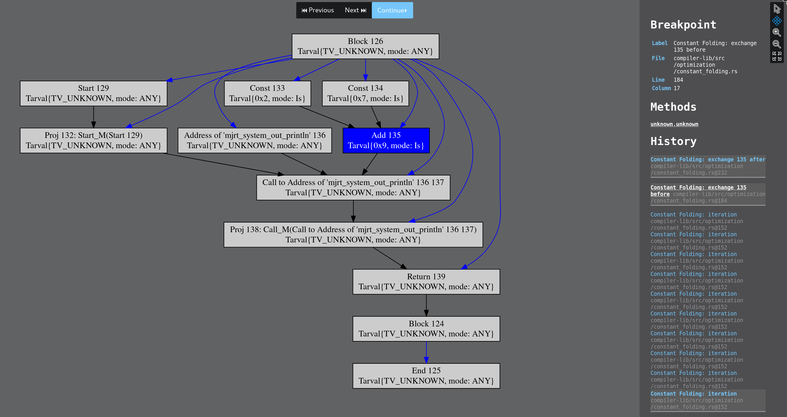

[](https://travis-ci.org/comprakt/comprakt)
[](https://comprakt.github.io/comprakt)
[](https://comprakt.github.io/comprakt/doxygen_libfirm/)

# comprakt

A [MiniJava](https://pp.ipd.kit.edu/lehre/WS201819/compprakt/intern/sprachbericht.pdf) compiler

## Checkout & Install Build Dependencies

```bash
# Check out this repo and submodules
git clone https://github.com/comprakt/comprakt.git
git submodule update --init --recursive
# Install Rust using rustup and the toolchain we are using
curl https://sh.rustup.rs -sSf | sh
rustup toolchain install nightly-2018-10-14

cd comprakt
rustup component add clippy-preview
rustup component add rustfmt-preview
```

Additionally, make sure the following build dependencies of *libFirm* are installed (see `libfirm-rs-bindings/build.rs`):
- Python (2.7.x or >=3.3 are supported)
- Perl
- an ANSI C99 compiler (gcc, clang, icc are known to work)
- Git
- GNU Make

More detailed Rust install instructions can be found at [rust-lang.org](https://www.rust-lang.org/en-US/install.html).

## Debugging and Testing

To run all unit and integration tests, run:

```
cargo test
```

To run only regression and integration tests, execute:

```
cargo test --test integration
```

To run only a specific kind of integration tests, e.g. binary tests, that run all compiler stages and the generated executable itself, execute:

```
cargo test --test integration binary::
```

To run only a specific integration test, e.g. the one that you are currently trying to fix:

```
cargo test --test integration binary::can_print
```

If you add a integration test file, through a shortcoming of the default rust
test runner, you might have to recompile parts of the crate:

```
cargo clean -p compiler-cli
```

If your patch changes a lot of reference files for stderr/stdout/exitcodes, you can automatically regenerate the references by running:

```
env UPDATE_REFERENCES=true cargo test --test integration
```

In case for binary tests, run it another time to regenerate the reference files
for the generated binaries.

If the compiler crashes during firm graph generation, VCG files are generated
in the `/compiler-cli/.tmpIR/` folder. (But note that if you are testing the
compiler directly by using `cargo run` instead of `cargo test`, VCG files are
generated in `.tmpIR/` in the root of the repository.)


## Tools

We use the tools [`rustfmt`](https://github.com/rust-lang-nursery/rustfmt)
to format our code and
[`clippy`](https://github.com/rust-lang-nursery/rust-clippy) as a linter to keep
the code clean, idiomatic and correct.
To run those tools use

```bash
cargo clippy
cargo fmt --all
```

For code that should **not** get formatted by `rustfmt` mark the code with

```rust
#[rustfmt::skip]
```

This should only be used sparingly, e.g. for tabular constant definitions where
you want to align the columns and similar cases.

A Clippy lint can be disabled similar to `rustc` lints:

```rust
#![allow(clippy::lint_group)]
#[allow(clippy::lint_name)]
```

Fixing a Clippy warning instead of just `allow`ing it, is almost always the
better option. Lints should only be disabled if it **really** does not make
sense to fix them or if it is a false positive.

## Workflow

To keep the code quality high and always have a master branch, that passes all
test all the time ([The Not Rocket Science
Rule](https://graydon2.dreamwidth.org/1597.html)), we aim to only add code to
the project via Pull Requests. Every PR should get reviewed by another person to
ensure keeping the code quality high (typos and simple one-line fixes can be
accepted by the author). After that the reviewer should use `bors` to merge the
PR. For big and/or major changes it is recommended to have at least two
reviewers.

Before creating a PR make sure to run

```bash
cargo clippy
cargo fmt --all
cargo test
# or
./build --ci
```

locally. If one of these commands produce an error the CI will fail.

Every code addition should include a test case for high test coverage.

## Merging Pull Requests

To always have a building master branch we want to use
[bors-ng](https://bors.tech/). Bors is a GitHub bot that prevents merge skew /
semantic merge conflicts, so when a developer checks out the master branch, they
can expect all of the tests to pass out-of-the-box.

To test a PR comment with `bors try`.

To approve (and merge) a PR comment with `bors r+`. If another person reviewed
and accepted the PR you can tell this `bors`, by commenting with (for example)
`bors r=flip1995`.

More commands for the bors-bot can be found in the
[documentation](https://bors.tech/documentation/).

## Using the Visual Debugger

The visual debugger is disabled by default. To enable it, enable the
`gui_debugger` feature during compilation. For example, to debug the constant
folding optimization run the following commands and then open
`http://localhost:8000`.

```
cd compiler-cli
cargo run --features "gui_debugger" -- --emit-asm my_file.mj  -O Custom:ConstantFolding.gui
```

You should see an interface that looks similar to the screenshot below.
The debugger will halt at each location annotated with the `breakpoint!`
macro. For a detailed explanation see the module-level documentation of
`compiler_lib::debugger`.



---
## License

Licensed under either of

 * Apache License, Version 2.0, ([LICENSE-APACHE](LICENSE-APACHE) or http://www.apache.org/licenses/LICENSE-2.0)
 * MIT license ([LICENSE-MIT](LICENSE-MIT) or http://opensource.org/licenses/MIT)

at your option.

